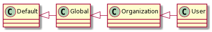

Concepts
========

Hierarkey is built to store key-value pairs. For example, you could use it to store
arbitrary preferences of your users that you do not want to create model fields for
because you have too many of them or because you generate them dynamically.

Storage hierarchy
-----------------

Hierarkey is built as a hierarchical store. For example, in your application users
might be associated with an organization. In that case, you can store key-value
pairs with the user, the organization or globally for your application.

If you fetch a value for a user, the value set for the user will be returned. If
the value has never been set for the user, the value set for the organization will
be returned. If the value has never been set for the organization, the globally
configured value will be returned. If no value has ever been set, the hardcoded
default will be returned. If no default exists for the key, ``None`` will be returned.

Note that this is only an example, you could build this hierarchy in any way you want.

Storage and data types
----------------------

The key-value pairs are stored into one database model per level of your hierarchy.
The values will be stored in a ``TextField``, so they will need to be serialized first.
When querying values, they need to be deserialized to get the original data type.
If you have hardcoded a default value for a key, it will have a type
associated. In this case, if you don't need to pass a type when querying, the
hardcoded type will be used for deserialization.
Otherwise, as hierarkey is not able to detect the data type from the saved
data, you need to pass the desired data type to the query function as
``as_type`` (see :ref:`the API reference <api>`).

Currently, the following data types are supported out of the box:

* ``str``, ``bool``, ``int``, ``float``
* ``list`` and ``dict`` with members that are serializable
* ``Decimal``
* ``datetime``, ``time``, ``date``
* Any Django model instances (only the primary key is stored, so this behaves like an unconstrained foreign key)
* ``django.core.files.File``

Hierarkey is built in a way that allows you to easily add custom defaults and :ref:`your own data types <customtype>`.
